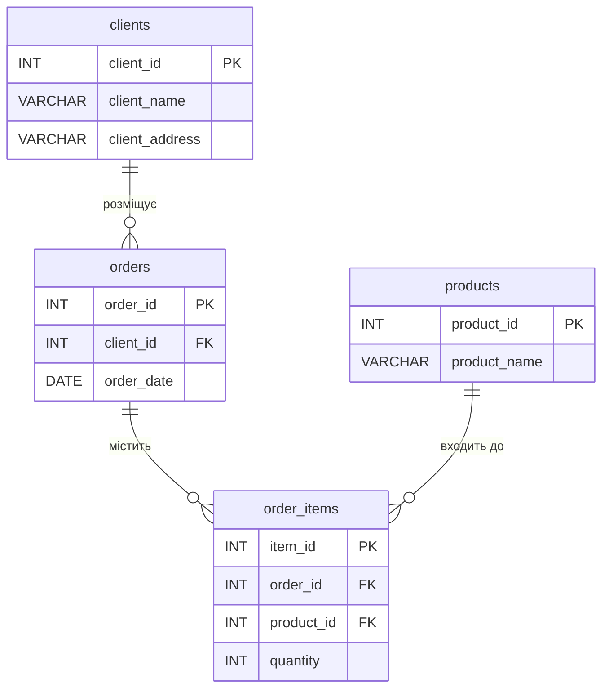

```mermaid
erDiagram
    clients {
        INT client_id PK
        VARCHAR client_name
        VARCHAR client_address
    }

    orders {
        INT order_id PK
        INT client_id FK
        DATE order_date
    }

    products {
        INT product_id PK
        VARCHAR product_name
    }

    order_items {
        INT item_id PK
        INT order_id FK
        INT product_id FK
        INT quantity
    }

    clients ||--o{ orders : "розміщує"
    orders ||--o{ order_items : "містить"
    products ||--o{ order_items : "входить до"
```
